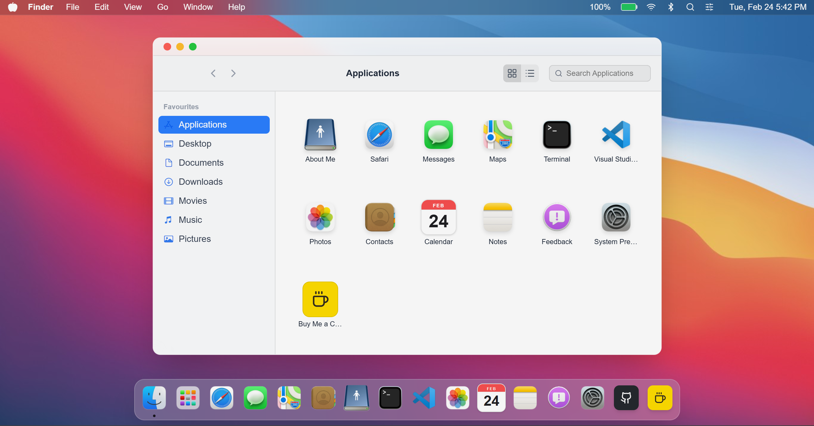

# Robu's macOS Portfolio

A pixel-perfect, highly realistic macOS-style interactive portfolio built with Next.js, React, Tailwind CSS, and Framer Motion.



## Features

- **macOS Experience:** Accurately recreated desktop environment with functional Dock, Menu Bar, and Window Management system.
- **Interactive Applications:** Deep integration of functional apps including:
  - **Built-in Apps:** Safari, Messages, Maps, Photos, Contacts, Calendar, Notes
  - **Utilities:** Terminal, Visual Studio Code (VS Code)
  - **System:** System Preferences, Finder (with interactive sidebar and file browsing)
  - **Custom Portfolio Additions:** About Me, Feedback, Buy Me a Coffee, GitHub integrations, Spotify Player
- **Window Management:** Drag, minimize, maximize, and close windows just like in macOS. Includes window stacking and realistic snapping constraints.
- **Spotlight Search:** Quick functional search utility to navigate and find information across the portfolio.
- **Control Center & Themes:** Quick settings panel to toggle between multiple customized themes (Light, Dark, and colorful variants) and adjust preferences.
- **Fluid Animations:** Smooth, buttery animations powered by Framer Motion mimicking native macOS behaviors.

## Tech Stack

- **Framework:** Next.js (React)
- **Styling:** Tailwind CSS
- **Animations:** Framer Motion
- **Icons:** Lucide React & Custom Assets

## Getting Started

First, install the dependencies and run the development server:

```bash
npm install
npm run dev
```

Open [http://localhost:3000](http://localhost:3000) with your browser to see the portfolio.

## Author

- **Robu**
